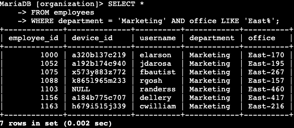

# SQL Filtering Guide: Investigating Security Issues

## Table of Contents

1. [Introduction](#introduction)
2. [Project Overview](#project-overview)
3. [Investigating After-Hours Failed Login Attempts](#investigating-after-hours-failed-login-attempts)
4. [Analyzing Login Attempts on Specific Dates](#analyzing-login-attempts-on-specific-dates)
5. [Examining Login Attempts Outside of Mexico](#examining-login-attempts-outside-of-mexico)
6. [Identifying Marketing Department Employees](#identifying-marketing-department-employees)
7. [Locating Finance and Sales Department Employees](#locating-finance-and-sales-department-employees)
8. [Finding Non-IT Department Employees](#finding-non-it-department-employees)
9. [Conclusion](#conclusion)

## Introduction

In the realm of cybersecurity, the ability to efficiently query and filter database information is crucial for investigating security incidents and managing system updates. This guide demonstrates the application of SQL queries to address various security-related scenarios within an organizational context.

## Project Overview

Our organization's security team has been tasked with investigating several security concerns involving login attempts and employee machines. The company's database contains separate tables for **employees** and **log_in_attempts**. By utilizing SQL queries, we can filter these tables to identify irregular events and systems, providing valuable insights for our security investigations.

## Investigating After-Hours Failed Login Attempts

A potential security breach was detected outside of regular business hours. To delve into this incident, I executed an SQL query to extract all unsuccessful login attempts that occurred after the standard working hours.

The SQL query shown in the first three lines of the image selects all columns from the **log_in_attempts** table. It applies filters to the `_login_time_` and `_login_success_` columns to isolate after-hours attempts that were unsuccessful. The query results revealed 19 instances of failed login attempts outside of business hours, providing crucial details such as the identity of the user attempting to log in, the country of origin, and the IP address associated with each attempt.

## Analyzing Login Attempts on Specific Dates

A suspicious event was flagged on 2022-05-09. To thoroughly investigate this occurrence, I examined all login attempts from both that day and the preceding day.

The SQL query displayed above selects all columns from the **log_in_attempts** table. It employs the **OR** operator to filter the results, showing only the attempts that took place on either 2022-05-09 or 2022-05-08.

## Examining Login Attempts Outside of Mexico

Another area of concern was unusual activity involving login attempts originating from countries other than Mexico. I crafted an SQL query to filter out all login attempts that occurred from locations outside of Mexico.

This query combines the SQL **NOT** operator with the **LIKE** operator and the **%** wildcard. This combination allows us to identify all logins from countries other than Mexico. The _country_ column in our table might contain variations such as "MEX" or "MEXICO", so the **%** wildcard is used to capture all values beginning with "MEX". The **NOT** operator then ensures that we retrieve every record that doesn't match this criteria.

## Identifying Marketing Department Employees

The security team needed to perform updates on specific machines belonging to marketing department employees. My task was to query for all marketing department employees located in any of the east building offices.

By utilizing SQL's **AND** and **LIKE** operators, I filtered the employees table to identify all staff members assigned to the "Marketing" department and situated in the east office building. Since the office building column could contain various values like "East-170" or "East-460", I again employed the **%** wildcard to search for all values in the office column starting with "East".

## Locating Finance and Sales Department Employees

The machines used by employees in the Finance and Sales departments required distinct security updates. I used SQL to filter the employee table and locate all staff members in these two departments.

In this query, I employed SQL's **OR** operator to filter the _department_ column, identifying all employees who work in either the Finance or Sales department.

## Finding Non-IT Department Employees

The IT department had already received a new security update, but all other departments still needed it. I crafted an SQL query to identify all employees and systems not associated with the IT department.

For this query, I applied a filter to the _department_ column using the **NOT** operator. This allowed me to find all rows where the department is not listed as "Information Technology".

## Conclusion

Through the application of SQL queries, I was able to provide our security team with comprehensive reports on relevant login events and employee information related to suspicious login attempts and system security updates. By leveraging SQL operators such as **AND**, **NOT**, **LIKE**, and **%**, I efficiently filtered through thousands of records to pinpoint login attempts on specific days, from particular countries, failed login attempts, and employees from targeted departments. This project demonstrated the power of SQL in retrieving critical records from the database, a task that would have been significantly time-consuming if done manually. The ability to quickly and accurately filter large datasets proves invaluable in responding to and investigating potential security incidents.
