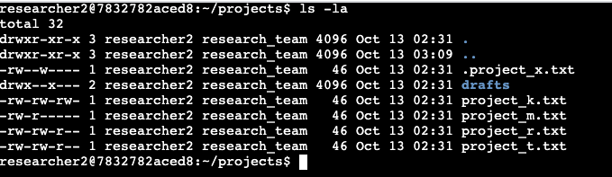

# Linux File Permissions

## Table of Contents

1. [Introduction](#introduction)
2. [Project Overview](#project-overview)
3. [Examining File and Directory Details](#examining-file-and-directory-details)
4. [Understanding Permission Strings](#understanding-permission-strings)
5. [Modifying File Permissions](#modifying-file-permissions)
6. [Adjusting Hidden File Permissions](#adjusting-hidden-file-permissions)
7. [Altering Directory Permissions](#altering-directory-permissions)
8. [Conclusion](#conclusion)

## Introduction

In the realm of Linux systems, managing file permissions is a crucial aspect of maintaining security and controlling access to sensitive information. This lab explores the process of updating file permissions using Bash commands, ensuring that the principle of least privilege is upheld within an organizational context.

## Project Overview

At my organization, the research team required an update to the file permissions for various files and directories. This project involved utilizing Bash commands to enhance the security of these files based on specific authorization levels. By employing common Bash commands such as `ls`, `chmod`, and `cd`, I was able to modify all relevant files and ensure that access was limited to only those users who required it, thereby adhering to the principle of least privilege.

## Examining File and Directory Details

To begin the process, I employed the `ls -la` command. This powerful command allows for the discovery of all files, including those that are hidden, and provides a comprehensive view of their current permissions. The output of this command categorizes permissions according to Linux's User, Group, and Other permission types.



## Understanding Permission Strings

The permission strings generated by the `ls -la` command offer valuable insights. They indicate whether an item is a file or a directory and detail the specific permissions granted to each permission type (User, Group, and Other). These permissions are broken down into read, write, and execute capabilities.

For instance, let's consider the file named `_project_k.txt_`. Its permission string `-rw-rw-rw-` indicates that it's a file (not a directory) and that all permission groups (User, Group, and Other) have been granted read and write access, but not execute permissions.

Upon inspection, it became apparent that many files and directories were configured with incorrect permissions. As an example, the `_.project_x.txt_` file, despite being an archived document, still allowed Group users to write to it - a permission that needed to be revoked.

## Modifying File Permissions

One of the organization's security policies prohibits the Other permission group from having write access to any files. However, the initial inspection revealed that `_project_k.txt_` still permitted write access for the Other group.

To rectify this, I utilized the `chmod` command in Bash to remove write access for the Other group:

```bash
chmod o-w project_k.txt
```


Following this modification, I verified that `_project_k.txt_` now only allows users in the Other group to read the file, but not write to it.


## Adjusting Hidden File Permissions

The `_.project_x.txt_` file, being an archived document, required special attention. The goal was to remove write permissions entirely while still allowing read access for the User and Group permission groups.

I executed the following command to achieve this:

```bash
chmod u-w,g-w,g+r .project_x.txt
```


This command sets read-only permissions for User and Group, while completely restricting access for Others. I then confirmed that the correct groups retained read access.


## Altering Directory Permissions

The final step involved modifying access permissions for directories. According to the organization's policy, directories should only be accessible to the User, with no permissions granted to other groups.

Using `chmod`, I updated the permissions of the _draft_ directory to remove execute permissions from the Group permission group:

```bash
chmod g-x draft
```


This modification ensured that only the User retained access permissions for the directory.


## Conclusion

As a cybersecurity analyst, managing file and directory access permissions is a critical responsibility. This project demonstrated the use of Bash commands to ensure the organization's filesystem adheres to correct access permissions. Many files initially had excessive permissions, violating the principle of least privilege and potentially exposing sensitive information to unauthorized parties. By leveraging Bash commands like `ls` and `chmod`, I was able to view and modify access permissions for different permission groups, aligning each user's access rights with the organization's authorization standards. This process significantly enhanced the overall security posture of the file system.
